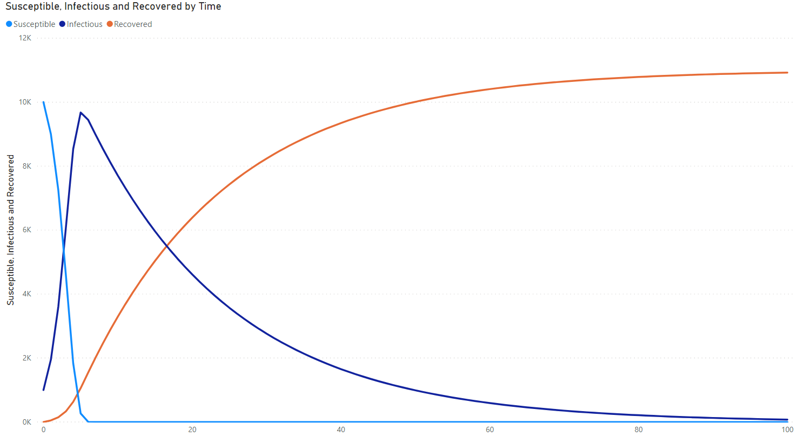

# sir-rs


SIR infectious disease modelling CLI

## Example Usage
The CLI takes 5 input parameters to the application to run the simulation.
- Recovery Rate (`gamma`)
- Infection Rate (`beta`)
- Time Steps (`t`)
- Initial Susceptible (S<sub>0</sub>)
- Initial Infectious (I<sub>0</sub>)
- Initial Recovered (R<sub>0</sub>)


```bash
cargo run -- {gamma} {beta} {t} {S} {I} {R}
```

<strong>Note</strong>: Please replace the `{}` values with your corresponding values.

Running this command will write a `csv` file to the directory in which the 
executable was running from called `results.csv`.

The schema for the `csv` is as follows:
| Column Index | Description |
| ------------ | ----------- |
| 0 | Time step / day|
| 1 | Number of susceptible people |
| 2 | Number of infectious people |
| 3 | Number of recovered people |


### Example
Running the following command results in the following data being generated:

```bash
cargo run -- 0.05 0.0001 100 10000 1000 0
```

```csv
0,10000,1000,0
1,9000,1950,50
2,7245,3607.5,147.5
3,4631.36625,6040.75875,327.875
4,1833.6696300857811,8536.417432414219,629.9129375
5,268.3726905305018,9674.893500348788,1056.733809120711
6,8.724970602034944,9450.796545259815,1540.4784841381504
7,0.47917839971441367,8986.502510199145,2013.018311401141
8,0.048564610527734864,8537.607998478374,2462.3434369110983
9,0.007102049799277241,8110.769061115184,2889.223836835017
10,0.0013417412210295259,7705.236368368003,3294.7622898907766
```

This dataset can then be visualized by the tool of your choice, but I will display an example in Power BI.



### Compiled Binary
To get the compile this project into a binary, run:
```bash
cargo build --release
```
The binary will be located in `./target/release/sir-rs`. If you are on a Windows machine, the binary will be a `.exe` file.

### Running the compiled binary
Ensure the binary has file permission to be executed.

Linux/macOS Command to run the binary:
```bash
cd ./target/release && ./sir-rs {gamma} {beta} {t} {S} {I} {R}
```

Windows command to run binay:
```bash
cd .\target\release && sir.exe {gamma} {beta} {t} {S} {I} {R}
```
## Model
Please visit https://en.wikipedia.org/wiki/Compartmental_models_in_epidemiology#SIR for details.